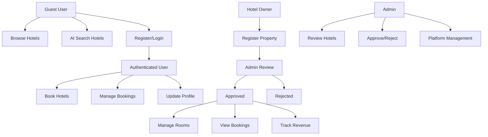

# IntelliStay - AI-Powered Hotel Management & Booking Platform

A comprehensive hotel management and booking platform featuring AI-integrated search capabilities, multi-role architecture, and complete hotel lifecycle management. Built as a modern alternative to traditional booking platforms with intelligent natural language processing and advanced hotel owner tools.

## 🌟 Key Features

### For Travelers
- 🤖 **AI-Powered Search**: Natural language hotel search using OpenAI integration
- 🏨 **Smart Recommendations**: AI-driven hotel suggestions based on preferences
- 💳 **Secure Payments**: Integrated payment processing with PayHere
- 📱 **Responsive Design**: Seamless experience across all devices
- 📋 **Booking Management**: Complete booking history and status tracking
- � **Secure Authentication**: Clerk-powered user authentication

### For Hotel Owners
- 🏢 **Hotel Management**: Complete property management dashboard
- �️ **Room Management**: Dynamic room creation and inventory control
- 📊 **Booking Analytics**: Real-time booking insights and revenue tracking
- 👥 **Guest Management**: Customer information and booking details
- 📸 **Media Management**: Cloudinary integration for image uploads
- ✅ **Admin Approval**: Hotel listing approval workflow

### For Administrators
- 🔍 **Hotel Approval System**: Review and approve new hotel listings
- 🚫 **Rejection Management**: Handle rejected applications with feedback
- 👨‍💼 **Platform Oversight**: Complete platform administration tools

## 🏗️ System Architecture

### User Roles & Workflow



## 🛠️ Technology Stack

### Frontend
- **Framework**: React 18 + Vite
- **Language**: JavaScript (ES6+)
- **Styling**: Tailwind CSS + shadcn/ui components
- **State Management**: Redux Toolkit + RTK Query
- **Authentication**: Clerk
- **UI Components**: Lucide React icons, Swiper.js carousel
- **Form Handling**: React Hook Form + Zod validation

### Backend
- **Runtime**: Node.js + Express.js
- **Language**: TypeScript
- **Database**: MongoDB + Mongoose ODM
- **Authentication**: Clerk Express SDK
- **Validation**: Zod schema validation
- **File Upload**: Multer + Cloudinary
- **AI Integration**: OpenAI API
- **Payment Processing**: PayHere (Sri Lankan payment gateway)

### Infrastructure & DevOps
- **Database**: MongoDB Atlas (Cloud)
- **Media Storage**: Cloudinary
- **Deployment**: Vercel (Frontend), Railway/Heroku (Backend)
- **Development**: Hot reloading with Nodemon


## 📁 Project Structure

```
IntelliStay/
├── backend/
│   ├── src/
│   │   ├── api/                    # API routes
│   │   │   ├── admin.ts           # Admin management endpoints
│   │   │   ├── booking.ts         # Booking management
│   │   │   ├── hotel.ts           # Hotel CRUD operations
│   │   │   ├── location.ts        # Location services
│   │   │   └── billingProfile.ts  # User billing profiles
│   │   ├── application/           # Business logic layer
│   │   │   ├── admin.ts          # Admin operations
│   │   │   ├── booking.ts        # Booking workflows
│   │   │   ├── hotel.ts          # Hotel management
│   │   │   └── utils/            # Utility functions
│   │   │       ├── embeddings.ts # AI vector embeddings
│   │   │       ├── hotelEmbedding.ts # Hotel AI search
│   │   │       └── payhere.ts    # Payment integration
│   │   ├── domain/               # Domain models & DTOs
│   │   │   ├── dtos/            # Data transfer objects
│   │   │   └── errors/          # Custom error classes
│   │   ├── infrastructure/       # Data access layer
│   │   │   ├── database.ts      # MongoDB connection
│   │   │   ├── clerk.ts         # Authentication setup
│   │   │   ├── seed.ts          # Database seeding
│   │   │   └── entities/        # Mongoose models
│   │   │       ├── Hotel.ts     # Hotel schema
│   │   │       ├── Booking.ts   # Booking schema
│   │   │       ├── Location.ts  # Location schema
│   │   │       └── BillingProfile.ts
│   │   └── types/               # TypeScript definitions
│   ├── package.json
│   └── tsconfig.json
│
├── frontend/
│   ├── src/
│   │   ├── components/
│   │   │   ├── ui/              # shadcn/ui components
│   │   │   ├── layouts/         # Layout components
│   │   │   ├── Header.jsx       # Navigation with auth
│   │   │   ├── HomeHero.jsx     # AI search hero section
│   │   │   ├── HotelCard.jsx    # Hotel display cards
│   │   │   ├── BookingCard.jsx  # Customer booking cards
│   │   │   ├── OwnerBookingCard.jsx # Owner booking management
│   │   │   ├── BillingProfileDialog.jsx
│   │   │   └── AISearchResults.jsx
│   │   ├── pages/
│   │   │   ├── Home.jsx         # Landing page
│   │   │   ├── Hotels.jsx       # Hotel listing
│   │   │   ├── HotelView.jsx    # Hotel details
│   │   │   ├── Bookings.jsx     # User bookings
│   │   │   ├── OwnerBookings.jsx # Owner dashboard
│   │   │   ├── BecomePartner.jsx # Hotel registration
│   │   │   ├── RoomManagement.jsx
│   │   │   └── AdminHotelRequests.jsx
│   │   ├── store/
│   │   │   ├── api.js           # RTK Query API
│   │   │   ├── store.js         # Redux store
│   │   │   └── features/        # Redux slices
│   │   ├── hooks/
│   │   ├── schemas/             # Form validation schemas
│   │   └── utils/
│   ├── package.json
│   └── vite.config.js
```

## 🔧 Key Features Implementation

### AI-Powered Search
- **Natural Language Processing**: OpenAI integration for understanding user queries
- **Vector Embeddings**: Hotel descriptions converted to embeddings for semantic search
- **Smart Recommendations**: AI-driven hotel suggestions based on user preferences
- **Query Understanding**: Handles complex queries like "romantic beachfront hotel under $200"

### Multi-Role Architecture
- **Guest Users**: Browse, search, and book hotels
- **Hotel Owners**: Manage properties, rooms, and view bookings
- **Administrators**: Approve hotels and manage the platform

### Payment Integration
- **PayHere Gateway**: Sri Lankan payment processing
- **Secure Transactions**: Encrypted payment handling
- **Booking Verification**: Webhook-based payment confirmation
- **Multiple Payment States**: PAID, PENDING, FAILED, CANCELLED

### Real-time Features
- **Live Booking Updates**: Real-time booking status changes
- **Instant Search**: Fast AI-powered search results
- **Dynamic Pricing**: Real-time room availability and pricing

## 🔌 API Endpoints

### Authentication
- `POST /auth/register` - User registration
- `POST /auth/login` - User login
- `GET /auth/profile` - Get user profile

### Hotels
- `GET /hotels` - Get all hotels with filters
- `GET /hotels/:id` - Get hotel details
- `POST /hotels/createhotel` - Create new hotel (Owner)
- `GET /hotels/owner/my-hotels` - Get owner's hotels
- `POST /hotels/:id/rooms` - Add room to hotel
- `GET /hotels/search/ai` - AI-powered hotel search

### Bookings
- `POST /bookings` - Create new booking
- `GET /bookings/user/:userId` - Get user bookings
- `GET /bookings/owner` - Get owner's property bookings
- `POST /bookings/payment/notify` - PayHere webhook

### Admin
- `GET /admin/hotel-requests` - Get pending hotel approvals
- `PUT /admin/approve/:id` - Approve hotel
- `PUT /admin/reject/:id` - Reject hotel with reason


## 🤖 AI Features Deep Dive

### Natural Language Search
```javascript
// Example queries that work:
"Find me a luxury hotel in Paris with spa facilities"
"Romantic beachfront resort under $300 per night"
"Pet-friendly accommodation near downtown with parking"
"Budget hotel in Tokyo with free WiFi and breakfast"
```

### AI Implementation
- **OpenAI GPT Integration**: Processes natural language queries
- **Vector Embeddings**: Hotels stored as semantic vectors
- **Similarity Search**: Finds matching hotels using cosine similarity
- **Query Enhancement**: AI improves and expands search terms

## 👥 User Workflows

### Guest User Journey
1. **Discovery**: Browse featured hotels or use AI search
2. **Search**: Enter natural language query for specific needs
3. **Selection**: View detailed hotel information and amenities
4. **Booking**: Complete secure booking with payment
5. **Management**: Track booking status and history

### Hotel Owner Journey
1. **Registration**: Submit hotel for platform approval
2. **Approval**: Wait for admin review and approval
3. **Setup**: Add rooms, amenities, and media
4. **Management**: Monitor bookings and guest information
5. **Analytics**: Track revenue and booking performance

### Admin Workflow
1. **Review**: Evaluate new hotel submissions
2. **Verification**: Check hotel details and credentials
3. **Decision**: Approve or reject with feedback
4. **Monitoring**: Oversee platform operations

## 🔒 Security Features

- **Authentication**: Clerk-powered secure user authentication
- **Authorization**: Role-based access control (Guest, Owner, Admin)
- **Data Validation**: Zod schema validation on all inputs
- **Payment Security**: Encrypted payment processing
- **API Security**: Protected endpoints with authentication middleware

## 📊 Performance Optimizations

- **Database Indexing**: Optimized MongoDB queries
- **Image Optimization**: Cloudinary automatic image processing
- **Caching**: RTK Query automatic caching
- **Code Splitting**: React lazy loading for better performance
- **Bundle Optimization**: Vite optimization for production builds


## 👨‍💻 Author

**Prabhash Wara**
- GitHub: [@prabhashwara07](https://github.com/prabhashwara07)
- Repository: [IntelliStay](https://github.com/prabhashwara07/IntelliStay)

## 🙏 Acknowledgments

- OpenAI for AI capabilities
- Clerk for authentication services
- Tailwind CSS & shadcn/ui for beautiful UI components
- MongoDB Atlas for database hosting
- Cloudinary for media management
